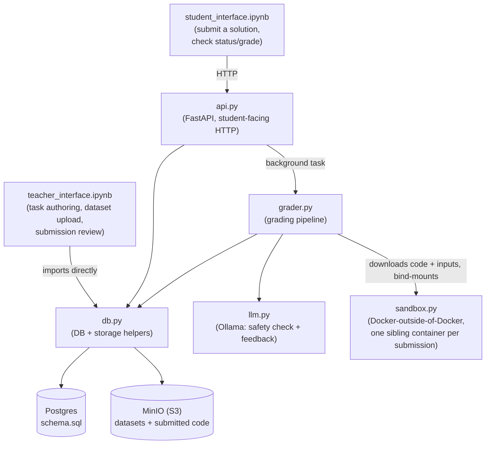

# Gryzun

Gryzun is a system for authoring programming tasks and automatically grading
students' Python solutions against them. A teacher creates a task with
sample (open) and test (hidden) input/output cases; students submit a
`.py` file; the platform runs it in a locked-down sandbox against every
case, scores it, and generates LLM feedback -- all without a human in the
loop for the first pass.

## How it fits together



- **Postgres** holds the relational model: teachers, topics, tasks, students,
  submissions, and per-case test results (see `schema.sql`).
- **MinIO** (S3-compatible object storage) holds the actual file bytes --
  task datasets and student-submitted code -- referenced from Postgres by an
  object key (`files.storage_key`).
- **`api.py`** is the only thing students talk to: submit a solution, poll a
  submission's status/grade. It never exposes hidden-test contents.
- **`grader.py`** is the background pipeline a submission goes through:
  LLM safety check → sandboxed execution against every dataset → scoring →
  LLM feedback.
- **`sandbox.py`** runs student code. The API container has no Docker
  daemon of its own -- it talks to the *host's* daemon over a mounted
  `/var/run/docker.sock` ("Docker-outside-of-Docker") to launch one
  network-disabled, resource-capped sibling container per submission.
- **`llm.py`** wraps a local Ollama server for two jobs: flagging dangerous
  code before it's ever executed, and writing student-facing feedback.
- Two Jupyter notebooks are the human interfaces: **`teacher_interface.ipynb`**
  (task authoring and grading admin, talks to Postgres/MinIO directly via
  `db.py`) and **`Grader/student_interface.ipynb`** (submit solutions, check
  grades, talks to `api.py` over HTTP only).

## Project layout

```
schema.sql                    Postgres schema
docker-compose.yml            full stack: db + minio + api
Dockerfile.sandbox            image untrusted student code actually runs in
migrate_storage_to_minio.py   one-off: upload legacy ./storage files into MinIO
teacher_interface.ipynb       teacher/admin notebook (direct DB + storage access)
db.py                         mirror of Grader/db.py, imported by the notebook above
requirements.txt              deps for the notebook / local dev environment
.env.example                  documents every environment variable below

Grader/                       everything the API container needs to build & run
  Dockerfile                  builds the `api` image (see docker-compose.yml)
  api.py                      FastAPI app -- the student-facing HTTP surface
  grader.py                   background grading pipeline
  sandbox.py                  Docker-outside-of-Docker sandboxed execution
  llm.py                      Ollama client (safety check + feedback)
  db.py                       DB + MinIO storage helpers (canonical copy)
  requirements-api.txt         deps for just the API image
  student_interface.ipynb     student notebook -- submit & check grades via HTTP
  .env                        standalone (non-compose) run config, see below

webapp/                       login-gated web app for students/teachers/admins
                               (see webapp/README.md) -- runs alongside the
                               notebooks/api above, unmodified, without
                               changing them
```

`db.py` intentionally exists in two places with identical content: the root
copy is imported directly by `teacher_interface.ipynb`, and `Grader/db.py` is
what actually ships in the API image. `Grader/db.py` is the canonical one --
if you change it, copy the change to the root file too.

## Quickstart (docker compose, full stack)

1. Copy `.env.example` to `.env` and fill in `PGPASSWORD` and
   `MINIO_ROOT_PASSWORD` (any value -- these just need to be *set*), plus
   `OLLAMA_BASE_URL`/`OLLAMA_MODEL` pointing at an Ollama server you control
   (local install or remote host -- compose does not run one for you).
2. Build the sandbox image once (this is what actually executes student
   code, separate from the API image):
   ```
   docker build -f Dockerfile.sandbox -t gryzun-sandbox:latest .
   ```
3. Start everything else:
   ```
   docker compose up --build
   ```
   This brings up Postgres (seeded from `schema.sql`), MinIO, and the API
   on `http://localhost:8000`. MinIO's console is at `http://localhost:9001`.
4. If you have pre-existing files under `./storage` from before this project
   used MinIO, run `python migrate_storage_to_minio.py` once to upload them
   under the same keys your `files` table already references.
5. Open `teacher_interface.ipynb` (`pip install -r requirements.txt` first,
   or reuse an existing Python environment) to register yourself as a
   teacher, create a topic, author a task with sample/test datasets, and
   publish it.
6. Point `Grader/student_interface.ipynb`'s `API_BASE_URL` at your running
   API and use it to submit a solution and watch it get graded.

## Running the API standalone (no compose)

`Grader/` is self-contained: `Grader/Dockerfile` only needs the files inside
`Grader/` to build, and `Grader/.env` is a standalone equivalent of the
environment variables `docker-compose.yml` normally injects -- useful if
Postgres/MinIO/Ollama already run somewhere else (a shared dev server, a
different host) and you just want the API container talking to them
directly instead of via compose's own network. Fill in `Grader/.env`, then:

```
cd Grader
docker build -t gryzun-api .
docker run -p 8000:8000 \
  -v /var/run/docker.sock:/var/run/docker.sock \
  gryzun-api
```

## Environment variables

See `.env.example` for the full, commented list. Summary:

| Variable | Used by | Purpose |
|---|---|---|
| `PGHOST`/`PGPORT`/`PGDATABASE`/`PGUSER`/`PGPASSWORD` | `db.py` | Postgres connection |
| `MINIO_ENDPOINT` | `db.py` | MinIO host:port |
| `MINIO_ACCESS_KEY`/`MINIO_SECRET_KEY` | `db.py` | MinIO credentials (default to `MINIO_ROOT_USER`/`MINIO_ROOT_PASSWORD`) |
| `MINIO_ROOT_USER`/`MINIO_ROOT_PASSWORD` | `docker-compose.yml`, `db.py` | Starts the `minio` service; doubles as its root access/secret key |
| `MINIO_BUCKET` | `db.py` | Bucket that holds task/submission files (auto-created if missing) |
| `MINIO_SECURE` | `db.py` | `true` if MinIO is behind TLS |
| `SCRATCH_ROOT` | `sandbox.py` | Where this process sees the ephemeral per-run scratch directory |
| `HOST_SCRATCH_ROOT` | `sandbox.py` | Where that same directory lives on the *host* -- required inside a container, since the host Docker daemon resolves bind-mount paths, not the container |
| `SANDBOX_IMAGE` | `sandbox.py` | Image built from `Dockerfile.sandbox` |
| `SANDBOX_TIMEOUT_SECONDS`/`SANDBOX_MEM_LIMIT`/`SANDBOX_PIDS_LIMIT` | `sandbox.py` | Per-case wall-clock timeout, memory limit, process limit |
| `OLLAMA_BASE_URL`/`OLLAMA_MODEL` | `llm.py` | LLM used for the safety check and feedback (override per-purpose with `OLLAMA_SAFETY_MODEL`/`OLLAMA_FEEDBACK_MODEL`) |
| `OLLAMA_TIMEOUT_SECONDS` | `llm.py` | Request timeout to Ollama |

## Data model

Defined in `schema.sql` (Postgres 14+):

- **`users`** -- teachers/admins.
- **`topics`** -- hierarchical task categories.
- **`levels`** -- difficulty reference table (easy/medium/hard).
- **`tasks`** -- a task's title/description/topic/level/status
  (`draft`/`published`/`archived`).
- **`files`** -- metadata for every uploaded file; `storage_key` is its MinIO
  object key.
- **`task_datasets`** -- input/output file pairs attached to a task, each
  either `sample` (visible to students) or `test` (hidden).
- **`students`**.
- **`submissions`** -- one student's `.py` solution to one task, its status
  (`submitted` → `checking` → `checked`/`needs_review`/`rejected`), auto
  score/feedback, and optional human review fields.
- **`submission_test_results`** -- per-dataset pass/fail, stdout/stderr,
  exit code, and timing for one submission.

## Grading pipeline (`grader.py`)

For each submission, in order:

1. **Safety check** -- `llm.py` asks the LLM whether the code looks
   dangerous. If it can't get a clear answer, the submission is marked
   `needs_review` and stops here. If flagged unsafe, it's `rejected` and
   never executed.
2. **Sandboxed execution** -- `sandbox.py` downloads the code and every
   dataset's input from MinIO into a throwaway scratch directory, then runs
   the code against each one inside a single sibling container (one
   `docker run`, one `exec` per test case).
3. **Scoring** -- pass/fail per case (exact stdout match), summarized as
   `auto_score`/`auto_max_score`. Sample-case detail (expected vs. actual
   output) is kept; hidden test-case content is deliberately never surfaced
   to the student-facing API.
4. **Feedback** -- `llm.py` writes student-facing feedback from the task
   description, the code, and the (redacted) results summary.

The submission ends as `checked`, or `needs_review` if any step couldn't
complete. The schema also has columns for a teacher's manual
`human_score`/`human_feedback`/`final_score` (surfaced by the API and read
in `teacher_interface.ipynb`), but nothing in this codebase writes them yet
-- that review step would need to be added.

## Sandbox isolation (`sandbox.py` + `Dockerfile.sandbox`)

Each submission runs in its own container, started with:

- `network_disabled=True` -- no network access at all.
- A memory limit with matching swap limit (no extra swap headroom).
- A pids limit, to cap fork bombs.
- `read_only=True` root filesystem, with only a small `tmpfs` at `/tmp`.
- `cap_drop=["ALL"]` and `no-new-privileges`.
- A non-root user (`sandboxuser`, uid 65532).
- A hard wall-clock timeout per test case via `timeout --signal=KILL`,
  which always exits 124 on a timeout regardless of what signal actually
  killed the child -- that's what makes timeout detection reliable.

## API reference (`Grader/api.py`)

All student-facing; nothing here ever returns hidden-test stdout/stderr,
expected output, or which cases were `sample` vs. `test`.

| Method & path | Purpose |
|---|---|
| `POST /submissions` | Submit a `.py` solution (multipart form: `task_id`, `student_email`, `student_full_name`, `file`). Returns `202` with a `submission_id`; grading runs in the background. |
| `GET /submissions/{id}` | Poll one submission's status, auto score/feedback, and human score/feedback if a teacher has reviewed it. |
| `GET /tasks` | List published tasks. |
| `GET /students/{email}/submissions` | A student's own submission history, optionally filtered by `?task_id=`. |

## Notebooks

- **`teacher_interface.ipynb`** (root) -- register teachers/topics, author a
  task with sample/test datasets, browse/publish tasks, export a task's
  sample data as a downloadable zip, browse and drill into submissions
  (including hidden test-case results, since this notebook has full DB
  access). Talks to Postgres/MinIO directly via `db.py` -- run it on a
  machine with DB/MinIO network access.
- **`Grader/student_interface.ipynb`** -- register your name/email, browse
  published tasks, submit a solution either by uploading a file from your
  browser or pointing at a local path, and watch it get graded. Talks only
  to `api.py` over HTTP (set `API_BASE_URL` at the top).
